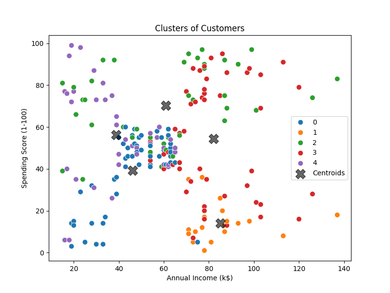
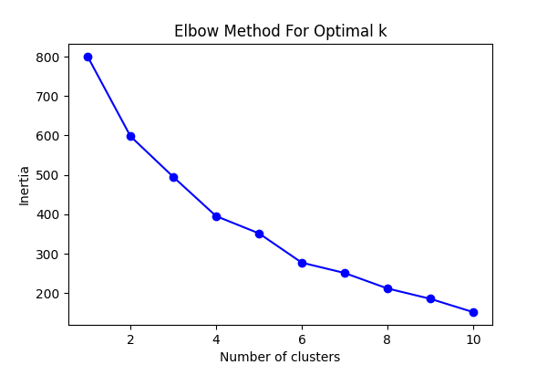
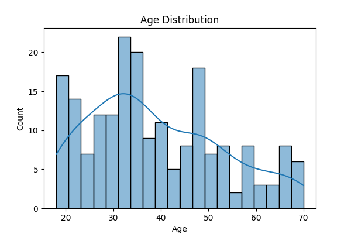
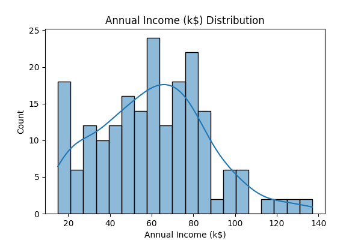
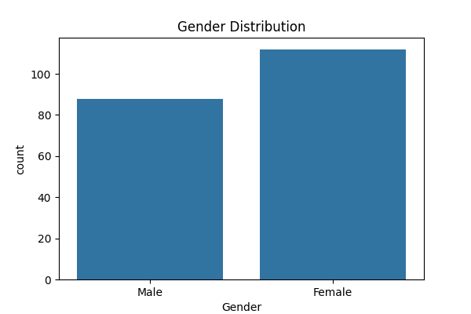

# 📈 Python Customer Segmentation using K-Means

## ✅ **Overview**
This project demonstrates **Customer Segmentation** using **K-Means Clustering** on the **Mall Customers Dataset**.  
The goal is to segment customers based on their **demographics, income, and spending behavior**, enabling **data-driven marketing strategies**.

✔️ **Exploratory Data Analysis (EDA)**  
✔️ **Feature Scaling**  
✔️ **K-Means Clustering**  
✔️ **Visualization of Clusters**  

---

## 📊 **Dataset Summary**
- **Rows:** 200  
- **Columns:** 5  
- **Missing Values:** None  

### 🏷️ **Column Details**
| Column Name                  | Description |
|-----------------------------|-------------|
| `CustomerID`               | Unique customer identifier *(integer)* |
| `Genre`                    | Gender of customer *(Male/Female)* |
| `Age`                      | Age of the customer *(integer)* |
| `Annual Income (k$)`       | Annual income in thousands of dollars *(integer)* |
| `Spending Score (1-100)`   | A score assigned based on spending habits *(integer)* |

---

## 🎯 **Use Cases**
- **Customer Segmentation** → Identify high-value segments  
- **Behavioral Analysis** → Study age, gender, and income patterns  
- **Clustering** → Apply K-Means for grouping customers  
- **Targeted Marketing** → Build personalized campaigns  

---

## ❓ **Key Questions**
- How are **Annual Income** and **Spending Score** related?  
- Does **Age** or **Gender** impact spending patterns?  
- Which customers have **high spending scores but low income**?  

---

## 🔍 **Analysis Techniques**
- **Descriptive Stats & Visualizations** → Histograms, scatter plots  
- **Feature Scaling** → StandardScaler for clustering  
- **K-Means Clustering** → Elbow method to find optimal clusters  
- **Cluster Profiling** → Understand each customer segment  

---

## 🛠 **Tech Stack**
- **Language:** Python  
- **Libraries:**  
  - `pandas`, `numpy` → Data manipulation  
  - `matplotlib`, `seaborn` → Visualization  
  - `scikit-learn` → K-Means, scaling  

---
## 📊 Customer Segment Results

### 1️⃣ Cluster Visualization - Customer Clusters beased on Spending Score and Annual Income

---

### 2️⃣ Elbow Method for Optimal K

---

### 3️⃣ Age Distribution Across Segments

---

### 4️⃣ Annual Income Distribution by Cluster

---

### 5️⃣ Gender Distribution by Cluster

